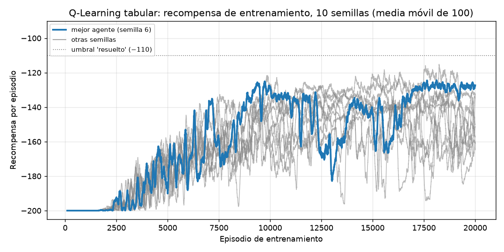
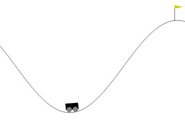
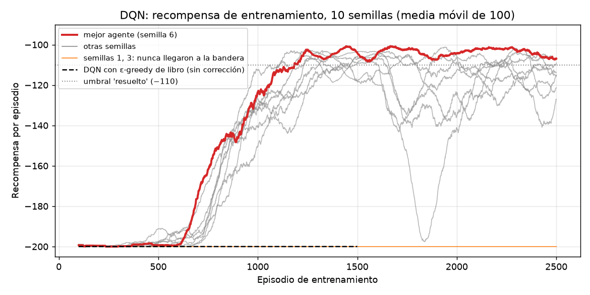
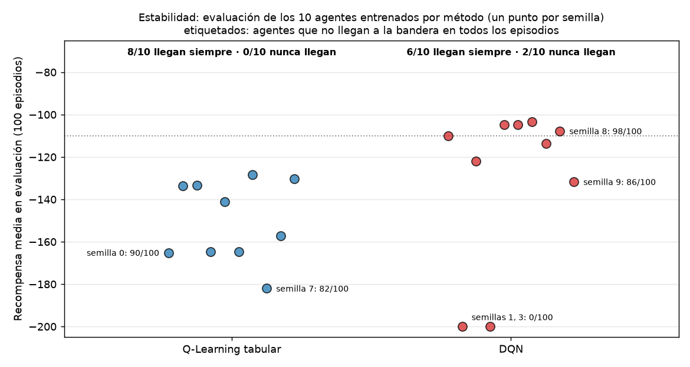
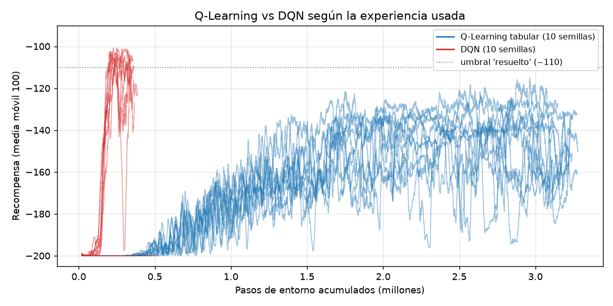
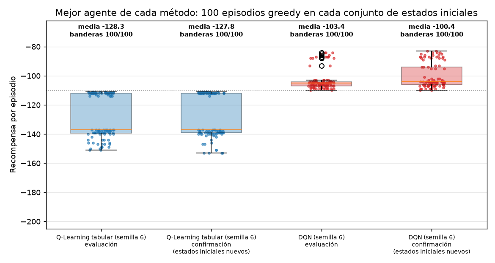
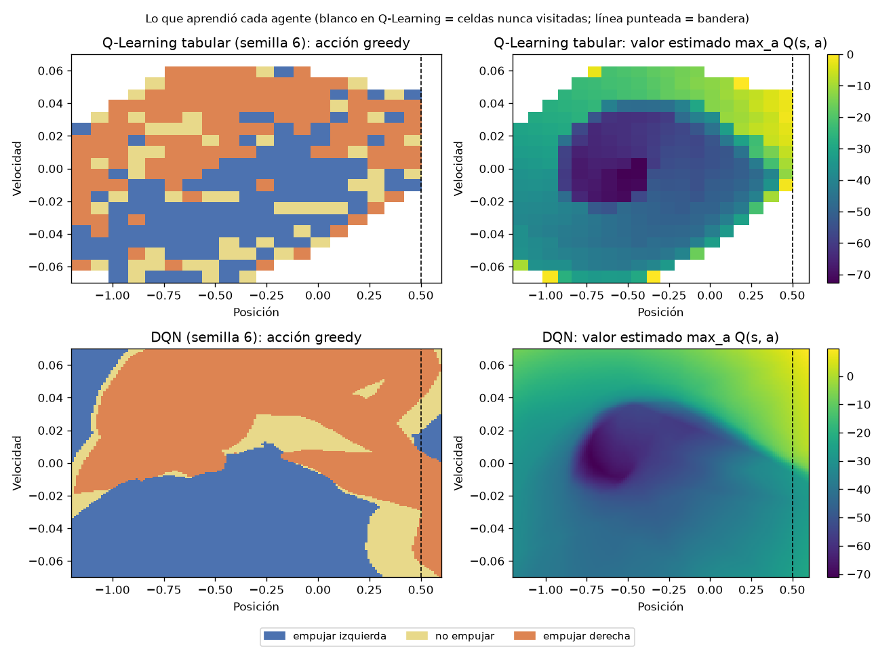

# Mountain Car: Q-Learning tabular vs. Deep Q-Network (DQN)

**David Santiago Iriarte Zamora** · Simulación y Aprendizaje por Refuerzo · MIA 2026-5 · Unidad 2

Este repositorio es una copia (fork) del repositorio base del curso,
[emiliomunozai/mountain_car](https://github.com/emiliomunozai/mountain_car). En él completé los tres
ejercicios de [EXERCISES.md](EXERCISES.md), entrené los dos agentes sobre `MountainCar-v0` y comparé
los resultados.

## Resumen

| | Q-Learning tabular | DQN |
|---|---|---|
| Mejor agente (evaluación en 100 episodios) | **−128,3** ± 15,1 (100/100 banderas) | **−103,4** ± 6,8 (100/100 banderas) |
| Mismo agente en 100 estados iniciales nuevos | −127,8 ± 14,8 (100/100) | −100,4 ± 8,3 (100/100) |
| Semillas que llegan siempre / nunca llegan (de 10) | 8 / **0** | 6 / **2** |
| Experiencia usada por entrenamiento | ~3,2 millones de pasos (20.000 episodios) | ~0,35 millones de pasos (2.500 episodios) |

- El **DQN** logra el mejor resultado: su mejor agente supera el umbral de "resuelto" (−110) y necesita
  unas 9 veces menos experiencia. A cambio, es **menos estable**: 2 de 10 semillas nunca encontraron la bandera.
- El **Q-Learning** es más lento y queda en un nivel más bajo, pero **ninguna semilla falló del todo**.
- El hallazgo más importante estuvo en el Ejercicio 3: el DQN "de libro" no aprende nada en este entorno.
  El problema no está en la red sino en la **exploración**: con acciones al azar paso a paso, el carro
  nunca llega a la bandera (0 de 300 episodios medidos). Lo resolví con una exploración que repite la
  acción anterior ([sección 5.3](#53-ejercicio-3-por-qué-el-dqn-no-aprendía)).

## Contenido

1. [El problema como proceso de decisión](#1-el-problema-como-proceso-de-decisión)
2. [Cómo ejecutar](#2-cómo-ejecutar)
3. [Estructura del repositorio](#3-estructura-del-repositorio)
4. [Q-Learning tabular (Ejercicio 1)](#4-q-learning-tabular-ejercicio-1)
5. [DQN (Ejercicios 2 y 3)](#5-dqn-ejercicios-2-y-3)
6. [Comparación entre los dos métodos](#6-comparación-entre-los-dos-métodos)
7. [Conclusiones](#7-conclusiones)
8. [Referencias](#referencias)

---

## 1. El problema como proceso de decisión

Un carro con un motor débil está en el fondo de un valle y tiene que llegar a la bandera en la cima de la
derecha. El motor no alcanza para subir directo, así que el carro tiene que ir y volver para ganar
impulso (Farama Foundation, 2024). Sutton y Barto usan este mismo problema como ejemplo, y lo describen
como una tarea en la que las cosas tienen que empeorar (alejarse de la meta) antes de mejorar (ejemplo
*Mountain–Car Task*, sección 9.4 del PDF del curso).

Lo formulé como un proceso de decisión de Markov (MDP) así:

| Elemento | En MountainCar-v0 |
|---|---|
| **Agente** | El controlador que decide cómo acelerar el carro. |
| **Estado** *s* | Dos números continuos: posición ∈ [−1,2 ; 0,6] y velocidad ∈ [−0,07 ; 0,07]. |
| **Acciones** *a* | 0 = acelerar a la izquierda, 1 = no acelerar, 2 = acelerar a la derecha. |
| **Transición** | velocidad ← velocidad + (acción − 1)·0,001 − cos(3·posición)·0,0025; posición ← posición + velocidad. Es determinista; solo la posición inicial es aleatoria, en [−0,6 ; −0,4]. |
| **Recompensa** *r* | −1 en cada paso. No hay premio por llegar: llegar simplemente termina el episodio. |
| **Fin del episodio** | *Terminado* si la posición llega a 0,5 (la bandera); *truncado* si se cumplen 200 pasos. |
| **Descuento** γ | 0,99 en ambos agentes. |

Como la recompensa siempre es −1, el retorno de un episodio es menos el número de pasos: **−200 es el
peor valor posible** (nunca llegó) y un resultado de **−110 o mejor se considera resuelto** (README del
repositorio base). El reto es que la recompensa no da ninguna pista de hacia dónde ir: el agente tiene
que tropezarse con la bandera explorando antes de poder aprender algo.

**Terminado vs. truncado.** Los dos ciclos de entrenamiento guardan `terminated` y no `terminated or
truncated`. Llegar a la bandera es un final real: ahí el objetivo no suma valores futuros. Cortar a los
200 pasos no lo es: el estado (posición, velocidad) no incluye el tiempo, así que el mismo estado puede
aparecer en el paso 50 o en el 200. Si el corte se tratara como final, el objetivo de la última
transición sería solo −1, como si ese estado estuviera junto a la meta. Eso enseñaría algo falso en casi
todos los episodios del comienzo, que terminan por tiempo.

## 2. Cómo ejecutar

Requisitos: [uv](https://docs.astral.sh/uv/). Él mismo instala Python 3.11 y las dependencias.

```bash
git clone https://github.com/dsiriarte/mountain_car.git
cd mountain_car
uv sync
```

### Comandos del CLI del curso

```bash
uv run mountaincar inspect                          # ver el entorno
uv run mountaincar train qlearning --episodes 20000 # entrenar Q-Learning (~0,5 min)
uv run mountaincar train dqn --episodes 2500        # entrenar DQN (~3 min en CPU)
uv run mountaincar load dqn --eval                  # evaluar 10 episodios
uv run mountaincar render dqn --episodes 3          # ver el carro en una ventana
```

Para ver directamente los **mejores agentes** que entrené, sin volver a entrenar:

```bash
cp results/qlearning/seed6.pkl saves/qlearning_mountaincar.pkl
cp results/dqn/seed6.pt saves/dqn_mountaincar.pt
uv run mountaincar render qlearning
uv run mountaincar render dqn
```

### Reproducir los experimentos de este README

```bash
uv run python experiments/diagnose.py                                    # diagnóstico del Ejercicio 3 (~2,5 min)
uv run python experiments/run_experiments.py --seeds 0 1 2 3 4 5 6 7 8 9 # 10 semillas por método, en paralelo
uv run python experiments/report.py                                      # figuras, GIF y results/summary.md
```

Todo usa semillas fijas. Verifiqué que al repetir una corrida se obtienen exactamente los mismos números.
Los tiempos son de un MacBook con M4 Pro, con cada entrenamiento en un solo núcleo de CPU.

## 3. Estructura del repositorio

```
src/mountain_car/
├── cli.py                  # CLI del curso (sin cambios)
└── agents/
    ├── qlearning.py        # Ejercicio 1: discretize, select_action, _update
    └── dqn.py              # Ejercicio 2: QNetwork, _learn · Ejercicio 3: select_action
experiments/
├── diagnose.py             # mediciones del Ejercicio 3
├── run_experiments.py      # entrena y evalúa (agente, semilla) en paralelo
└── report.py               # figuras, GIF y tabla resumen
results/
├── diagnosis/              # evidencia del diagnóstico (JSON, CSV y salida de consola)
├── tuning/                 # ajuste de explore_repeat (0,9 vs 0,95)
├── qlearning/  dqn/        # 10 semillas: log de entrenamiento, recompensas, evaluación, modelo
├── figures/                # gráficas y GIF usados en este README
├── summary.md              # tabla completa por semilla
└── cli_eval_best_agents.txt
docs/esquemas/              # esquemas del entrenamiento (dibujos propios)
```

Además de los ejercicios, al código del curso solo le agregué un parámetro opcional `seed` en `train()`,
para poder repetir los experimentos, y el hiperparámetro `explore_repeat` del DQN (Ejercicio 3).

---

## 4. Q-Learning tabular (Ejercicio 1)

### 4.1 Esquema del entrenamiento


En cada paso del episodio: se toma el **estado** continuo y se **discretiza** en una celda de la cuadrícula
de 20×20 → se elige una **acción** con ε-greedy mirando la fila de esa celda en la tabla Q → el entorno
devuelve la **recompensa** (−1) y el nuevo estado → se **actualiza** Q(s, a) hacia el objetivo TD → se
avanza al nuevo estado. Al terminar cada episodio, ε se multiplica por 0,9995.

### 4.2 Implementación

- **`discretize`**: `np.digitize` ubica la posición y la velocidad en uno de 20 intervalos cada una y
  devuelve la tupla `(i, j)`, que sirve como llave de la tabla. Los valores por fuera de los bordes caen en
  la primera o la última celda, así que no se crean llaves nuevas.
- **`select_action`**: ε-greedy (Sutton y Barto, 2018, sección 2.2). Con probabilidad ε elige una acción
  al azar y, si no, la de mayor Q. Con `deterministic=True` nunca explora, que es lo que usan la evaluación
  y el render.
- **`_update`**: la actualización de Q-Learning (Sutton y Barto, 2018, sección 6.5), escrita en dos líneas:

  ```
  objetivo = r + γ · max_a' Q(s', a')      (solo r si el episodio terminó en la bandera)
  Q(s, a) ← Q(s, a) + α · (objetivo − Q(s, a))
  ```

  Es la versión muestreada de la ecuación de optimalidad de Bellman para q\* (sección 3.8 del PDF del
  curso): en lugar de calcular el valor esperado con un modelo del entorno, usa la transición que acaba
  de ocurrir.

| Hiperparámetro | Valor |
|---|---|
| Celdas por dimensión (`n_bins`) | 20 (400 estados) |
| Tasa de aprendizaje α | 0,1 |
| Descuento γ | 0,99 |
| ε | 1,0 → 0,01, multiplicado por 0,9995 en cada episodio (llega a 0,01 en el episodio 9.209) |
| Valor inicial de la tabla Q | 0 |
| Episodios | 20.000 |

### 4.3 Mejor resultado



| Mejor agente: semilla 6 | |
|---|---|
| Evaluación greedy, 100 episodios | **−128,3 ± 15,1** (mejor −111, peor −151), **100/100** banderas |
| Confirmación, 100 estados iniciales nuevos | −127,8 ± 14,8, 100/100 banderas |
| CLI del curso (`mountaincar load qlearning --eval`) | −126,7 ± 14,7, 10/10 banderas |
| Celdas visitadas | 297 de 400 |



*Episodio greedy del mejor Q-Learning: llega a la bandera en 149 pasos (recompensa −149).*

**Comentario.** Durante los primeros ~1.500 episodios la curva está plana en −200: el agente todavía no
ha encontrado la bandera. En las 10 semillas, la primera bandera aparece entre los episodios 1.536 y
1.998. Después mejora de forma sostenida, pero la curva sigue siendo ruidosa hasta el final, con caídas de hasta
unos 50 puntos que luego se recuperan. El resultado final (−128) está cerca del valor que anticipa el repositorio del
curso (≈ −133) y no alcanza el umbral de −110. La causa se ve en el mapa de política de la
[sección 6](#6-comparación-entre-los-dos-métodos): con celdas de 0,09 en posición y 0,007 en velocidad,
estados que necesitan acciones diferentes quedan en la misma celda.

---

## 5. DQN (Ejercicios 2 y 3)

### 5.1 Esquema del entrenamiento


Hay dos ciclos que corren al tiempo. En el ciclo de **actuar**, el estado entra a la red en línea, que
devuelve los tres valores Q; se elige una acción con ε-greedy (con acción persistente) y la transición
(s, a, r, s', terminated) se guarda en el **replay buffer**. En el ciclo de **aprender**, en cada paso se
saca un mini-lote aleatorio de 64 transiciones del buffer. La **red target**, congelada y sin gradientes,
calcula max Q(s', ·) para armar el **objetivo de Bellman**, y la pérdida MSE entre Q(s, a) y ese objetivo
actualiza solo la red en línea. Cada 10 episodios, los pesos de la red en línea se copian a la red target.

### 5.2 Implementación (Ejercicio 2)

- **`QNetwork`**: red totalmente conectada 2 → 128 → 128 → 3 con ReLU en las capas ocultas y sin
  activación en la salida, porque son valores Q (aquí todos negativos) y no probabilidades. Tiene
  17.283 parámetros.
- **`_learn`**, sobre un mini-lote de 64 transiciones del replay buffer:
  1. `current_q = q_net(s).gather(1, a)`: el valor Q de la acción que realmente se tomó, forma (64, 1).
  2. `next_q = target_net(s').max(1, keepdim=True)`, dentro de `torch.no_grad()`: la red target no recibe
     gradientes.
  3. `target_q = r + γ · next_q · (1 − terminated)`: el objetivo de Bellman, sin el término futuro cuando
     el episodio terminó en la bandera.
  4. MSE entre `current_q` y `target_q`, y un paso de Adam (`zero_grad → backward → step`).

  Revisé que `current_q` y `target_q` tuvieran la misma forma, (64, 1), para evitar un *broadcast*
  silencioso. El replay buffer y la sincronización de la red target ya venían en el repositorio del curso.

**Prueba de que el aprendizaje está bien.** Antes de pelear con MountainCar, entrené el mismo agente en
`CartPole-v1`: la recompensa media subió de 20 a 225 en 100 episodios
([results/diagnosis/cartpole_sanity.txt](results/diagnosis/cartpole_sanity.txt)). La red y el paso de
Bellman funcionan.

### 5.3 Ejercicio 3: por qué el DQN no aprendía

Con el Ejercicio 2 terminado, el DQN con ε-greedy "de libro" se queda en **−200 todo el tiempo**. Antes de
cambiar algo, medí qué estaba pasando ([experiments/diagnose.py](experiments/diagnose.py); resultados en
[results/diagnosis/](results/diagnosis/)).

**1. El agente nunca ve la bandera.** Jugué 300 episodios con acciones al azar, como hace ε-greedy cuando
explora, y conté cuántos terminan en la bandera:

| Forma de explorar | Episodios que llegan (de 300) |
|---|---:|
| Acción uniforme nueva en cada paso (ε-greedy de libro) | **0** |
| Repetir la acción anterior con probabilidad 0,5 | 0 |
| … con probabilidad 0,8 | 5 |
| … con probabilidad **0,9** | **14** |
| … con probabilidad 0,95 | 26 |
| … con probabilidad 0,98 | 22 |

Para subir, el carro necesita empujar muchos pasos seguidos en la misma dirección, hacia un lado y luego
hacia el otro, como en un columpio. Si cada paso sortea una acción nueva, los empujones se cancelan entre
sí y el carro solo tiembla en el fondo del valle.

**2. La red aprendió que nada importa.** Medí los valores Q del DQN "de libro" en 200 estados al azar
mientras entrenaba:

| Episodios | Q media | Diferencia entre acciones (máx − mín) | Banderas hasta ese momento |
|---:|---:|---:|---:|
| 250 | −22,2 | 0,015 | 0 |
| 750 | −52,9 | 0,013 | 0 |
| 1.500 | −77,6 | 0,018 | 0 |

Si todas las recompensas son −1 y nunca hay una meta, el valor de cualquier estado tiende a
−1 / (1 − 0,99) = −100, y la Q media va bajando hacia allá. La diferencia entre las tres acciones es
prácticamente cero: la red dice que da lo mismo qué hacer. Con los datos que recibió, eso es correcto. La
red aprendió bien; el problema está antes, en cómo se recogen los datos.

**3. ¿Por qué el Q-Learning sí aprende con ε-greedy normal?** La tabla Q empieza en 0 y todos los valores
reales son negativos, así que cada celda nueva parece mejor que las ya visitadas. Cuando el agente actúa
de forma greedy, termina yendo a donde todavía no ha estado. Sutton y Barto llaman a esto *valores
iniciales optimistas* (sección 2.5, *Optimistic Initial Values*, del PDF del curso). En su ejemplo del
Mountain Car explican que esa inicialización en cero produce exploración aunque ε sea 0. Lo comprobé con
5.000 episodios de Q-Learning:

| Valor inicial de la tabla Q | Primera bandera | Banderas en 5.000 episodios |
|---|---:|---:|
| 0 (optimista) | episodio 1.903 | 1.189 |
| −100 (el valor de nunca llegar) | nunca | 0 |

El DQN no tiene ese empujón. La red generaliza: una actualización cambia también los valores de estados
parecidos, así que no quedan zonas "optimistas" intactas que atraigan al agente. En el diagnóstico, la Q
media de 200 estados tomados al azar de todo el espacio ya había bajado a −22 en el episodio 250, con una
diferencia casi nula entre acciones.

**La corrección.** Solo cambié cómo se eligen las acciones exploratorias, no la regla de aprendizaje, la
recompensa ni el entorno. En `select_action`, cuando el agente explora, **repite la acción exploratoria
anterior con probabilidad `explore_repeat`**, y si no, sortea una nueva. Así las rachas duran en promedio
1 / (1 − 0,9) = 10 pasos, suficiente para mecer el carro. La acción guardada se reinicia al empezar cada
episodio, `explore_repeat` quedó en `_HPARAMS` para que se guarde y se cargue con el agente, y con
`deterministic=True` sigue siendo greedy puro. Con `explore_repeat=0` se recupera exactamente el
ε-greedy de libro: el diagnóstico lo usa y da los mismos números, bit a bit.

Para escoger el valor comparé 0,9 y 0,95 con la misma semilla
([results/tuning/](results/tuning/)): 0,9 obtuvo −110,1 en evaluación y 0,95 obtuvo −117,4, ambos con
100/100 banderas. Me quedé con **0,9**.

| Hiperparámetro | Valor |
|---|---|
| Red | 2 → 128 → 128 → 3, ReLU |
| Optimizador / tasa de aprendizaje | Adam / 0,001 |
| Descuento γ | 0,99 |
| ε | 1,0 → 0,01, multiplicado por 0,995 en cada episodio (llega a 0,01 en el episodio 919) |
| `explore_repeat` | 0,9 |
| Mini-lote / tamaño del replay buffer | 64 / 100.000 |
| Actualización de la red target | cada 10 episodios |
| Episodios | 2.500 |

### 5.4 Mejor resultado



| Mejor agente: semilla 6 | |
|---|---|
| Evaluación greedy, 100 episodios | **−103,4 ± 6,8** (mejor −84, peor −110), **100/100** banderas |
| Confirmación, 100 estados iniciales nuevos | −100,4 ± 8,3, 100/100 banderas |
| CLI del curso (`mountaincar load dqn --eval`) | −100,4 ± 8,5, 10/10 banderas |


*Mismo estado inicial que el GIF del Q-Learning: el DQN llega en 108 pasos (recompensa −108).*

**Comentario.** La línea negra punteada es el DQN sin corrección: plano en −200. Con la exploración
persistente, 8 de 10 semillas encuentran la bandera muy pronto (entre los episodios 1 y 23). Aun así, la
curva no sube hasta cerca del episodio 600 y cruza −150 entre los episodios 808 y 1.002. El mejor agente
queda por encima del umbral de −110 y del valor que anticipa el curso (≈ −106). La confirmación en
estados iniciales nuevos (−100,4) muestra que el resultado no depende de los estados con que se escogió el
mejor agente. Al final del entrenamiento, la media de los últimos 100 episodios (−106,9) queda un poco por
debajo de la evaluación (−103,4): en el entrenamiento todavía hay un 1 % de acciones exploratorias y la
red sigue cambiando.

Hay dos cosas que muestran la inestabilidad del DQN:

- **Las semillas 1 y 3 nunca encontraron la bandera** y se quedaron en −200, igual que el DQN sin
  corrección. La exploración persistente vuelve alcanzable la bandera, pero sigue siendo un evento raro
  (14 de 300 episodios con acciones al azar), y ε baja rápido: llega a 0,1 en el episodio 460 y a 0,01 en
  el 919. Si en esa ventana el agente no tropieza con la bandera, ya no explora lo suficiente y queda
  atrapado.
- **La semilla 8 colapsó temporalmente** hasta −197,6 (media móvil) cerca del episodio 1.838 y después se
  recuperó (evaluación final −107,8, 98/100 banderas).

---

## 6. Comparación entre los dos métodos

### 6.1 Evidencia

**Estabilidad entre semillas.** Entrené 10 agentes por método, con las semillas 0 a 9 y los mismos
hiperparámetros:



**Velocidad de aprendizaje según la experiencia usada** (pasos de entorno, que son el costo real de
interactuar):



**Mejor agente de cada método** en los 100 estados iniciales de evaluación y en los 100 estados nuevos de
confirmación:



**Lo que aprendió cada uno.** A la izquierda, la acción que elige cada agente en cada estado; a la derecha,
el valor estimado del estado:



Los dos agentes aprendieron la misma idea: **empujar a la derecha cuando el carro va hacia la derecha
(velocidad positiva) y a la izquierda cuando va hacia la izquierda**, o sea, el vaivén de columpio. En
el DQN la regla es limpia y cubre todo el espacio de estados. En el Q-Learning se ve por bloques y con
celdas "ruidosas", y alrededor de 100 de las 400 celdas nunca se visitaron (en blanco). En los mapas de
valor, los dos muestran el "hueco" de −60 a −70 en el fondo del valle con velocidad cero, que es el peor
lugar para estar.

La tabla completa por semilla está en [results/summary.md](results/summary.md).

### 6.2 Tabla comparativa

| Aspecto | Q-Learning tabular | DQN |
|---|---|---|
| **Estabilidad del entrenamiento** | Ninguna semilla falla del todo: 8/10 llegan siempre a la bandera y las otras 2 llegan en 90 y 82 de 100 episodios. Pero cada curva es ruidosa hasta el final, y entre semillas el resultado va de −128 a −182. | Cuando aprende, las semillas quedan cerca unas de otras (−103 a −132), pero **2/10 nunca encuentran la bandera** y una colapsó a mitad del entrenamiento y se recuperó. Depende mucho de encontrar la bandera temprano. |
| **Velocidad de aprendizaje** | Lenta en experiencia: primera bandera entre los episodios 1.536 y 1.998; media móvil ≥ −150 entre los episodios 5.875 y 7.827; ~3,2 millones de pasos. Rápida en tiempo de reloj: ~0,5 min por entrenamiento. | Unas 9 veces más eficiente en experiencia: media móvil ≥ −150 entre los episodios 808 y 1.002 (~0,35 millones de pasos). Cada paso cuesta más cómputo (un paso de gradiente con 64 transiciones), así que tarda ~3 min por entrenamiento. |
| **Desempeño final** | Mejor agente: −128,3 (−127,8 en confirmación). Media de las 10 semillas: −150,0. No alcanza el umbral de −110. | Mejor agente: **−103,4** (−100,4 en confirmación), por encima del umbral de −110. Media de las 6 semillas que llegan siempre: −109,8; media de las 10: −129,8 (arrastrada por las 2 que fallaron). |
| **Ventajas** | Simple y transparente: la tabla se puede inspeccionar celda por celda. Sin redes ni GPU. La tabla en 0 (optimista) le da exploración "gratis" y lo vuelve robusto. | Trabaja con el estado continuo sin discretizar y generaliza entre estados parecidos, por eso su política es más fina. Reutiliza cada transición muchas veces gracias al replay buffer. |
| **Limitaciones** | La discretización pierde información (celdas de 0,09 × 0,007 mezclan estados distintos) y crece exponencialmente con más dimensiones: 20 celdas por variable ya son 400 estados con 2 variables. | Necesita la corrección de exploración para aprender algo en este entorno. Es sensible a la semilla, tiene más hiperparámetros (red, buffer, target, lote) y cuesta más cómputo por paso. |
| **Dificultad de implementación** | Baja: los tres ejercicios suman unas 6 líneas. El único cuidado es separar `terminated` de `truncated`. | Media-alta: formas de tensores, `gather`, `no_grad` en la red target, `terminated` vs. `truncated`, y sobre todo diagnosticar por qué no aprendía, que no era un error de código sino de exploración. |

### 6.3 ¿Por qué el DQN rinde más cuando funciona?

1. **Generaliza.** La red representa Q como una función continua de (posición, velocidad), así que lo que
   aprende en un estado sirve para los vecinos. La tabla trata cada celda por separado y no puede
   distinguir estados dentro de la misma celda.
2. **Aprovecha mejor la experiencia.** En cada paso de entorno hace una actualización con 64
   transiciones sacadas del replay buffer, así que cada transición se usa muchas veces. El Q-Learning
   usa cada transición una sola vez.

Y es menos estable por lo que vimos en el diagnóstico: la red no tiene el optimismo de la tabla, así que
solo aprende si la exploración la lleva a la bandera antes de que ε se apague.

## 7. Conclusiones

- Los dos métodos aprenden la misma estrategia de vaivén, pero el **DQN** la aprende mejor (−103 contra
  −128) y con unas 9 veces menos experiencia, gracias a que generaliza y reutiliza transiciones.
- El **Q-Learning** es más simple y más robusto en este problema: su tabla optimista lo obliga a explorar,
  y ninguna de 10 semillas falló del todo. Su techo lo pone la discretización.
- La lección principal es que **el algoritmo solo puede aprender de lo que la exploración le muestra**. El
  DQN "de libro" hacía bien sus cálculos y aun así aprendía que "nada importa", porque nunca vio la
  bandera. Medir antes de cambiar código (0/300 episodios, la diferencia entre acciones ≈ 0) fue lo que
  mostró dónde estaba el problema.
- Si tuviera que escoger para este entorno, usaría el **DQN** para el mejor desempeño, entrenando varias
  semillas y quedándome con la mejor, porque una sola corrida puede fallar.

## Referencias

Farama Foundation. (2024). *Gymnasium documentation: Mountain Car*.
https://gymnasium.farama.org/environments/classic_control/mountain_car/

Muñoz, E. (2026). *mountain_car* [Repositorio de GitHub]. https://github.com/emiliomunozai/mountain_car

Sutton, R. S., & Barto, A. G. (2018). *Reinforcement learning: An introduction* (2.ª ed.). MIT Press.
Las secciones citadas siguen la numeración del PDF entregado en el curso.
